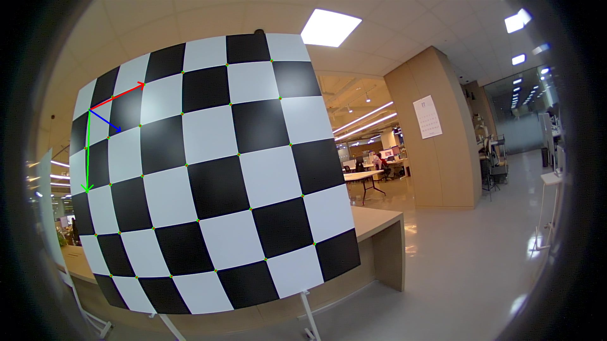
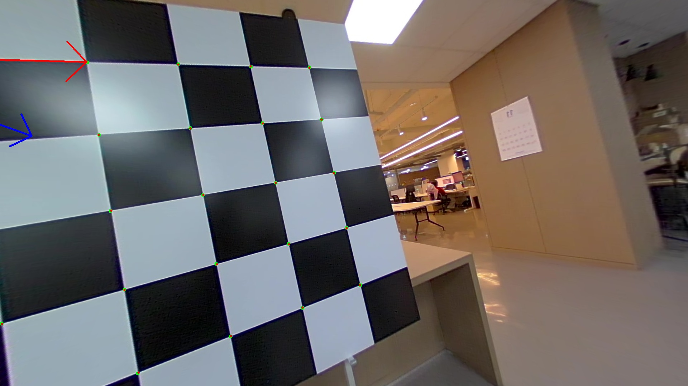
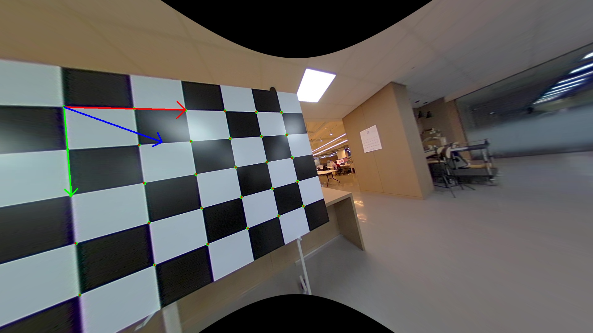
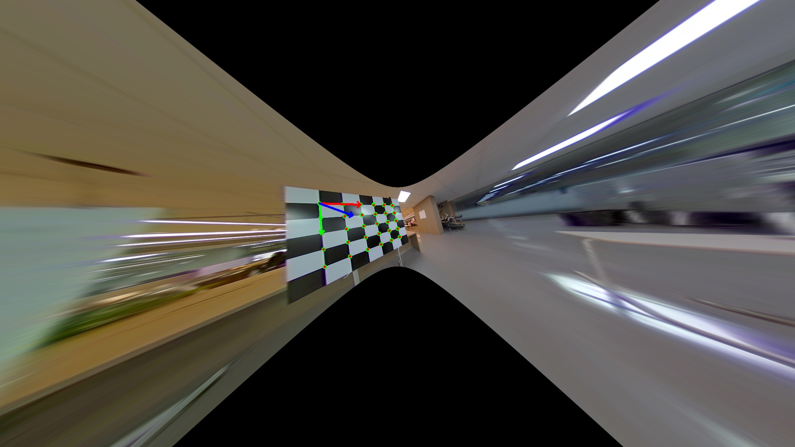

# Double Sphere Camera Model (DS-MSP)

**Production-ready fisheye camera implementation for 3D vision tasks.**

This repository provides a robust, OpenCV-compatible wrapper for the **Double Sphere (DS) Camera Model**. It is designed to be easy to understand, test, and integrate, while offering deep technical insights into the model's capabilities and limitations.

---

## 1. Quick Start

```python
from ds_camera import DoubleSphereCamera
import ds_camera_cv
import cv2
import numpy as np

# 1. Load camera from calibration
cam = DoubleSphereCamera.from_json('test_config.json')

# 2. Undistort image (OpenCV style)
img = cv2.imread('assets/test_image.jpg')
K = np.array([[cam.fx, 0, cam.cx], [0, cam.fy, cam.cy], [0, 0, 1]])
D = np.array([cam.xi, cam.alpha])

# Estimate new camera matrix for optimal crop
K_new = ds_camera_cv.estimateNewCameraMatrixForUndistortRectify(K, D, (1920, 1080), balance=1.0)
img_undist = ds_camera_cv.undistortImage(img, K, D, K_new)

# 3. Solve PnP (Robust for Fisheye)
# points_3d: (N, 3), points_2d: (N, 2)
success, rvec, tvec = ds_camera_cv.solvePnP(points_3d, points_2d, K, D)
```

**See [`examples.py`](examples.py) for more complete examples.**

---

## 2. Why Double Sphere?

| Feature | Double Sphere | Kannala-Brandt | OpenCV Fisheye |
|---------|---------------|----------------|----------------|
| **Unprojection** | ✅ Closed-form | ❌ Iterative | ❌ Iterative |
| **Speed** | ✅ Fast (O(1)) | ⚠️ Slower | ⚠️ Slower |
| **PnP Ready** | ✅ Direct | ❌ Needs iteration | ❌ Needs undistortion |
| **Accuracy** | ✅ ~0.1 pixel | ✅ ~0.1 pixel | ✅ ~0.1 pixel |
| **Stability** | ✅ No failures | ⚠️ Can diverge | ⚠️ Can fail |

**Bottom line:** For real-time applications and PnP, Double Sphere is the best choice.

---

## 3. Installation

Simply copy the core files to your project:
- `ds_camera.py`: The core class implementation.
- `ds_camera_cv.py`: The OpenCV-compatible wrapper.

Dependencies:
```bash
pip install numpy opencv-python
```

---

## 4. The Double Sphere Model (Theory)

### For Beginners
Fisheye lenses capture a very wide field of view (often > 180°), much like a human eye or a security camera. Standard "pinhole" camera models assume straight lines stay straight, which fails for these curved lenses. The **Double Sphere** model is a mathematical way to accurately describe how these lenses bend light, allowing us to "straighten" (undistort) the images or calculate precise 3D positions.

### For Experts
The Double Sphere model projects 3D points onto the unit sphere, then onto a second sphere shifted by $\xi$, and finally onto the image plane. It is defined by two parameters:
- $\xi$: Shift parameter (controls distortion).
- $\alpha$: Sphere parameter (controls FOV).

**Forward (3D → 2D):**
```
d1 = ||p||
z1 = z + ξ·d1
d2 = ||(x, y, z1)||
u = fx · x / (α·d2 + (1-α)·z1) + cx
v = fy · y / (α·d2 + (1-α)·z1) + cy
```

**Inverse (2D → 3D ray, closed-form!):**
```
mx = (u - cx) / fx, my = (v - cy) / fy
r² = mx² + my²
mz = (1 - α²·r²) / (α·√(1-(2α-1)·r²) + 1-α)
k = (mz·ξ + √(mz² + (1-ξ²)·r²)) / (mz² + r²)
ray = normalize([k·mx, k·my, k·mz - ξ])
```

---

## 5. Technical Deep Dive: FOV & Undistortion

**Generated by:** `analyze_fov_limit.py`, `visualize_fov_zones.py`

A common question is: *"Why are pixels missing from my undistorted image, even when I try to keep the whole image?"*

### 5.1. The "Cone of Invalidity" (Mathematical Explanation)
The Double Sphere model defines a projection function $\pi(\mathbf{x})$. However, this function is not valid for all 3D points. There exists a specific region where the projection fails, known as the "Cone of Invalidity".

**The Condition:**
The projection is valid only if:
$$den = \alpha \sqrt{x^2 + y^2 + (z + \xi \sqrt{x^2 + y^2 + z^2})^2} + (1-\alpha)(z + \xi \sqrt{x^2 + y^2 + z^2}) > 0$$

Geometrically, this inequality defines a **cone-shaped volume** behind the camera center. Points inside this cone cannot be projected onto the image plane.

### 5.2. Visualization (Augmented FOV Zones)
We generated an augmented visualization that overlays the **FOV Zones** directly onto the real image (Sample 96).
- **Green Zone (Frontal FOV)**: $\theta < 90^\circ$. Safe for standard pinhole projection.
- **Yellow Zone (Side/Back FOV)**: $90^\circ \le \theta < \theta_{limit}$. Valid in DS model, but mathematically impossible to project to a single pinhole image ($Z \le 0$).
- **Red Zone (Invalid Cone)**: $\theta \ge \theta_{limit}$. Mathematically impossible in DS model.
- **White Stars**: Real data keypoints. Notice how they all fall safely within the Green/Yellow valid regions.


**Reference**: [Double sphere model projection-failed region](https://jseobyun.tistory.com/457?category=1170976)

### 5.3. The Practical Limit (Infinite Size)
Even pixels in the **Yellow Zone** ($Z \le 0$) cannot be undistorted to a pinhole image.
- A pinhole camera can only see things **in front of it** ($Z > 0$).
- Rays at 90° project to infinity ($x/z \to \infty$).
- To capture these pixels, the undistorted image would need to be **infinitely wide**.


*Bright: Preserved pixels. Dark: Lost pixels (due to mathematical or practical limits).*

---

## 6. Real Data Verification

**Generated by:** `test_pose_undistort.py`

We verified the wrapper on real data (`assets/test_image.jpg` and `assets/test_image_96.jpg`). We estimated the camera pose and visualized the reprojected 3D points (red) and axes (RGB).

### Sample 11
| Distorted | Undistorted (Crop) | Undistorted (Whole) | Undistorted (Zoom) |
| :---: | :---: | :---: | :---: |
|  |  |  |  |

### Sample 96
| Distorted | Undistorted (Crop) | Undistorted (Whole) | Undistorted (Zoom) |
| :---: | :---: | :---: | :---: |
|  |  |  |  |

---

## 7. Geometric Accuracy Verification

**Generated by:** `verify_k_inverse.py` and `verify_3d_reconstruction.py`

We performed rigorous checks to ensure the undistorted images are geometrically accurate for 3D measurement.

### 7.1. Inverse Projection ($K^{-1}$) Analysis
We verified that any pixel $(u, v)$ in the undistorted image can be unprojected to a 3D ray using $\mathbf{d} = K_{new}^{-1} [u, v, 1]^T$.
- **Mean Error**: < 0.00003 pixels (across all modes).
- **Status**: ✅ Verified.

### 7.2. 3D Reconstruction Verification
We reconstructed the absolute 3D positions of the checkerboard corners from the undistorted images.
- **Mean Position Error**: `1.168 mm`
- **Reconstructed Square Size**: `20.01 cm` (Target: 20.00 cm)
- **Status**: ✅ Verified.

**Conclusion:** The undistorted images produced by this wrapper are **geometrically accurate pinhole projections** suitable for precise 3D computer vision tasks.

---

## 8. Robust PnP Strategy

Our wrapper implements a robust PnP strategy for fisheye lenses that avoids the need for iterative undistortion approximations.

- **Reference**: [Fisheye camera model solvePnP](https://jseobyun.tistory.com/455)
- **Method**:
    1.  **Unproject** 2D fisheye points to 3D unit rays $\mathbf{d} = (x, y, z)$.
    2.  **Normalize** these rays to the $Z=1$ plane: $\mathbf{u}_{norm} = (x/z, y/z)$.
    3.  **Solve PnP** using `cv2.solvePnP` with an **Identity Camera Matrix** ($K=I$) and **Zero Distortion**.
    
    This effectively treats the unprojected rays as observations from a perfect pinhole camera with $f=1$, allowing standard PnP solvers to work with high accuracy on wide-angle data. Our `ds_camera_cv.solvePnP` implements this exact logic.

---

## 9. License

MIT License - Feel free to use in your projects!

---

**Happy coding! 🚀**
