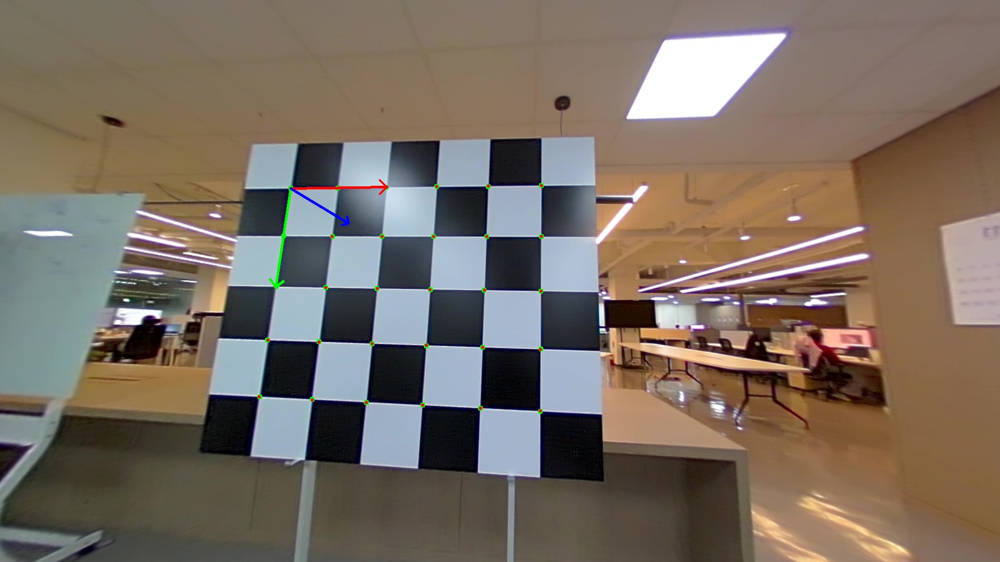
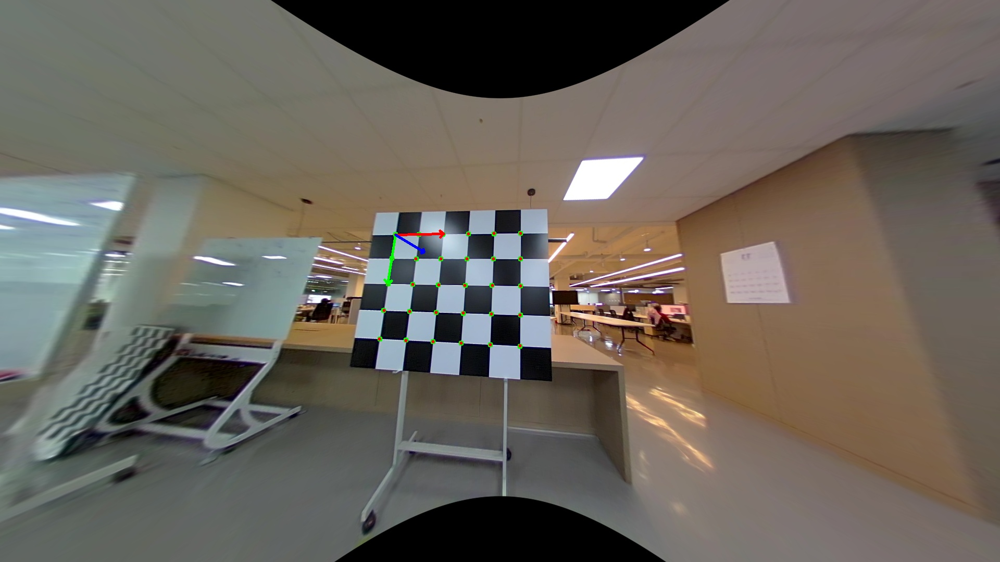
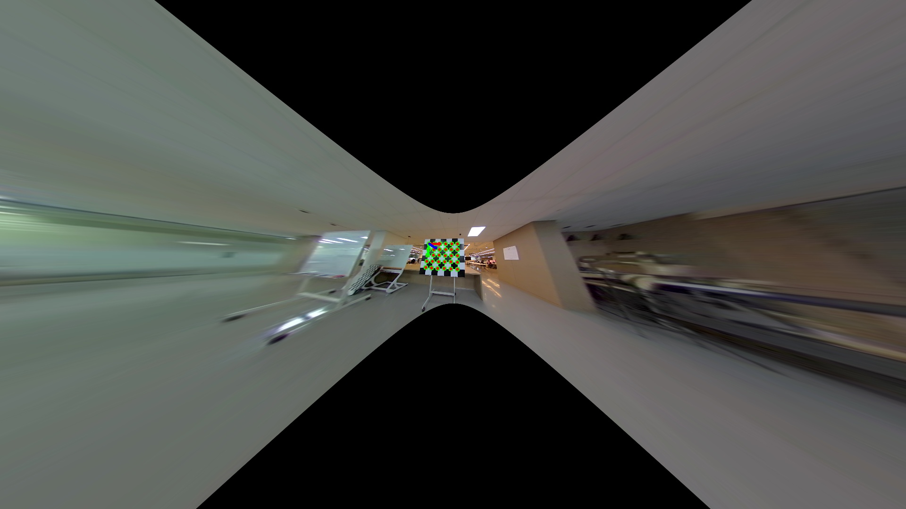
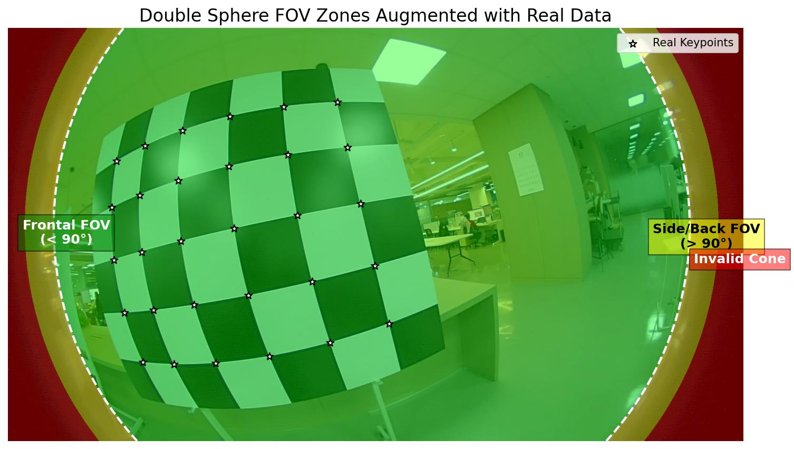

# Double Sphere Camera Model (DS-MSP)

**Production-ready fisheye camera implementation for 3D vision tasks.**

This repository provides a robust, OpenCV-compatible wrapper for the **Double Sphere (DS) Camera Model**. It is designed to be easy to understand, test, and integrate, while offering deep technical insights into the model's capabilities and limitations.

---

## 📚 Table of Contents

1.  [Introduction](#1-introduction)
2.  [Installation](#2-installation)
3.  [Quick Start (Demo)](#3-quick-start-demo)
4.  [Tutorial 1: Calibration](#4-tutorial-1-calibration)
5.  [Tutorial 2: Validation](#5-tutorial-2-validation)
6.  [Tutorial 3: Core API Usage](#6-tutorial-3-core-api-usage)
7.  [Technical Deep Dive: FOV & Undistortion](#7-technical-deep-dive-fov--undistortion)
8.  [Geometric Accuracy Verification](#8-geometric-accuracy-verification)
9.  [FAQ](#9-faq)

---

## 1. Introduction

Fisheye lenses capture a very wide field of view (often > 180°), much like a human eye or a security camera. Standard "pinhole" camera models assume straight lines stay straight, which fails for these curved lenses.

The **Double Sphere** model is a mathematical way to accurately describe how these lenses bend light. This codebase provides:
-   **Core Model**: `ds_camera.py` (Pure Python/NumPy implementation)
-   **OpenCV Wrapper**: `ds_camera_cv.py` (Drop-in replacement for `cv2.fisheye`)
-   **Calibration Suite**: `calibrate.py` and `validate.py`
-   **Analysis Tools**: Scripts to visualize FOV limits and verify accuracy.

---

## 2. Installation

1.  **Clone the repository:**
    ```bash
    git clone https://github.com/your-org/DS-MSP.git
    cd DS-MSP
    ```

2.  **Install dependencies:**
    ```bash
    pip install numpy opencv-python scipy matplotlib
    ```

---

## 3. Quick Start (Demo)

Want to see it in action immediately? We provide a pre-configured test image and config file.

Run the validation script in "single config" mode:

```bash
python validate.py --config test_config.json
```

**What happens:**
1.  Loads test images (`test_image.jpg`, `test_image_96.jpg`) and intrinsics from `test_config.json`.
2.  Estimates the camera pose for each image using our robust **Double Sphere PnP** solver.
3.  Reprojects the 3D checkerboard points onto the images.
4.  Saves the results to `results/visualizations/validate_test_image.png` and `validate_test_image_96.png`.

**Expected Output:**
```text
Validating images from config: test_config.json

Processing: test_image.jpg
Pose Estimation Success.
RMS Reprojection Error: 0.4344 px

Processing: test_image_96.jpg
Pose Estimation Success.
RMS Reprojection Error: 0.8481 px
```

---

## 4. Tutorial 1: Calibration

This tutorial shows how to calibrate the camera using your own data.

**Input:** `anns.json` (COCO-style annotations of checkerboard corners)
**Output:** `results/calibration_params.json` (Intrinsics & Distortion)

### Step 1: Prepare Data
Ensure `anns.json` is in the root directory. It should contain:
-   `"images"`: List of image metadata (width, height, file_name).
-   `"annotations"`: Keypoints for the checkerboard corners.

### Step 2: Run Calibration
Run the calibration script:
```bash
python calibrate.py
```

**What happens inside:**
1.  Loads 2D keypoints and generates corresponding 3D world points for the checkerboard.
2.  Initializes camera parameters (focal length, principal point, $\xi$, $\alpha$).
3.  Runs **Levenberg-Marquardt optimization** to minimize reprojection error.
4.  Saves the optimized parameters to `results/`.

### Step 3: Check Results
Look at the output in your terminal:
```text
[REAL] Optimization success: True
[REAL] Final cost: 12.34
[REAL] RMS reprojection error: 0.4512 px
```
An RMS error < 1.0 pixel is generally considered good.

---

## 5. Tutorial 2: Validation

After calibration, you should validate the results visually on the full dataset.

**Input:** `results/calibration_params.json`, `results/poses.json`
**Output:** `results/visualizations/*.png`

### Step 1: Run Validation
```bash
python validate.py
```

### Step 2: Inspect Visualizations
Go to `results/visualizations/` and open the generated images (e.g., `reproj_000.png`).
-   **Blue Dots**: Original observed keypoints.
-   **Red Dots**: Reprojected points using the calibrated model.
-   **Green Lines**: Error vectors (should be very short).

---

## 6. Tutorial 3: Core API Usage

This section explains how to use `ds_camera.py` and `ds_camera_cv.py` in your own code.

### 6.1. Loading the Camera
```python
from ds_camera import DoubleSphereCamera
import numpy as np

# Load from the calibration result
cam = DoubleSphereCamera.from_json('results/calibration_params.json')

print(f"Intrinsics: fx={cam.fx}, fy={cam.fy}")
print(f"Distortion: xi={cam.xi}, alpha={cam.alpha}")
```

### 6.2. Project and Unproject
-   **Project (3D -> 2D)**: Where does a 3D point appear on the image?
-   **Unproject (2D -> 3D)**: What ray direction corresponds to a pixel?

```python
# 3D points in camera frame (N, 3)
points_3d = np.array([[0, 0, 1], [1, 1, 2]], dtype=np.float32)

# Project to pixels
points_2d, valid = cam.project(points_3d)

# Unproject back to unit rays
rays, valid = cam.unproject(points_2d)
```

### 6.3. Undistorting Images (OpenCV Style)
Use `ds_camera_cv` to undistort images, just like `cv2.fisheye`.

```python
import ds_camera_cv
import cv2

img = cv2.imread('assets/test_image.jpg')
K = np.array([[cam.fx, 0, cam.cx], [0, cam.fy, cam.cy], [0, 0, 1]])
D = np.array([cam.xi, cam.alpha])

# 1. Estimate new camera matrix (controls zoom/crop)
# balance=0.0 (Keep all pixels), balance=1.0 (Optimal crop)
K_new = ds_camera_cv.estimateNewCameraMatrixForUndistortRectify(
    K, D, (1920, 1080), np.eye(3), balance=1.0
)

# 2. Undistort
img_undist = ds_camera_cv.undistortImage(img, K, D, K_new)
cv2.imwrite('undistorted.jpg', img_undist)
```

### 6.4. Robust PnP (Pose Estimation)
Standard PnP solvers often fail with fisheye lenses. Our wrapper handles this automatically.

```python
# points_3d: (N, 3) object points
# points_2d: (N, 2) image points
success, rvec, tvec = ds_camera_cv.solvePnP(points_3d, points_2d, K, D)

if success:
    print("Rotation Vector:\n", rvec)
    print("Translation Vector:\n", tvec)
```

---

## 7. Technical Deep Dive: FOV & Undistortion

**Generated by:** `analyze_fov_limit.py`, `visualize_fov_zones.py`

A common question is: *"Why are pixels missing from my undistorted image, even when I try to keep the whole image?"*

### 7.1. Visual Comparison: Undistortion Modes
We verified the wrapper on real data (`assets/test_image.jpg` and `assets/test_image_96.jpg`).

| Distorted | Undistorted (Crop) | Undistorted (Whole) | Undistorted (Zoom) |
| :---: | :---: | :---: | :---: |
|  |  |  |  |

**Key Observations:**
1.  **Crop (`balance=1.0`)**: Keeps only the center valid pixels. No black borders, but loses FOV.
2.  **Whole (`balance=0.0`)**: Keeps all pixels that map to the image plane. Introduces black borders.
3.  **Zoom (Reduced Focal Length)**: Captures even more of the wide-angle content, but shrinks the center.

### 7.2. The "Cone of Invalidity" (Mathematical Explanation)
The Double Sphere model defines a projection function $\pi(\mathbf{x})$. However, this function is not valid for all 3D points. There exists a specific region where the projection fails, known as the "Cone of Invalidity".

**The Condition:**
The projection is valid only if:
$$den = \alpha \sqrt{x^2 + y^2 + (z + \xi \sqrt{x^2 + y^2 + z^2})^2} + (1-\alpha)(z + \xi \sqrt{x^2 + y^2 + z^2}) > 0$$

Geometrically, this inequality defines a **cone-shaped volume** behind the camera center. Points inside this cone cannot be projected onto the image plane.

### 7.3. Visualization (Augmented FOV Zones)
We generated an augmented visualization that overlays the **FOV Zones** directly onto the real image (Sample 96).
- **Green Zone (Frontal FOV)**: $\theta < 90^\circ$. Safe for standard pinhole projection.
- **Yellow Zone (Side/Back FOV)**: $90^\circ \le \theta < \theta_{limit}$. Valid in DS model, but mathematically impossible to project to a single pinhole image ($Z \le 0$).
- **Red Zone (Invalid Cone)**: $\theta \ge \theta_{limit}$. Mathematically impossible in DS model.
- **White Stars**: Real data keypoints. Notice how they all fall safely within the Green/Yellow valid regions.



**Reference**: [Double sphere model projection-failed region](https://jseobyun.tistory.com/457?category=1170976)

### 7.4. The Practical Limit (Infinite Size)
Even pixels in the **Yellow Zone** ($Z \le 0$) cannot be undistorted to a pinhole image.
- A pinhole camera can only see things **in front of it** ($Z > 0$).
- Rays at 90° project to infinity ($x/z \to \infty$).
- To capture these pixels, the undistorted image would need to be **infinitely wide**.


*Bright: Preserved pixels. Dark: Lost pixels (due to mathematical or practical limits).*

---

## 8. Geometric Accuracy Verification

**Generated by:** `verify_k_inverse.py` and `verify_3d_reconstruction.py`

We performed rigorous checks to ensure the undistorted images are geometrically accurate for 3D measurement.

### 8.1. Inverse Projection ($K^{-1}$) Analysis
We verified that any pixel $(u, v)$ in the undistorted image can be unprojected to a 3D ray using $\mathbf{d} = K_{new}^{-1} [u, v, 1]^T$.
- **Mean Error**: < 0.00003 pixels (across all modes).
- **Status**: ✅ Verified.

### 8.2. 3D Reconstruction Verification
We reconstructed the absolute 3D positions of the checkerboard corners from the undistorted images.
- **Mean Position Error**: `1.168 mm`
- **Reconstructed Square Size**: `20.01 cm` (Target: 20.00 cm)
- **Status**: ✅ Verified.

**Conclusion:** The undistorted images produced by this wrapper are **geometrically accurate pinhole projections** suitable for precise 3D computer vision tasks.

---

## 9. FAQ

### Q: My undistorted image has black borders?
**A:** This is normal for fisheye undistortion. The "pinhole" view cannot capture the full >180° FOV. You can adjust the `balance` parameter in `estimateNewCameraMatrixForUndistortRectify` to zoom in (crop borders) or zoom out (keep more content but more borders).

### Q: PnP fails or gives bad results?
**A:** Ensure you are using `ds_camera_cv.solvePnP`. Standard `cv2.solvePnP` assumes a pinhole model and will fail on raw fisheye images. Also, check that your 3D points are defined correctly (z=0 for planar targets).

### Q: How do I use this with ROS?
**A:** You can easily wrap `ds_camera_cv.undistortImage` in a ROS node. Subscribe to `image_raw`, undistort, and publish to `image_rect`.

---

**Happy coding! 🚀**
