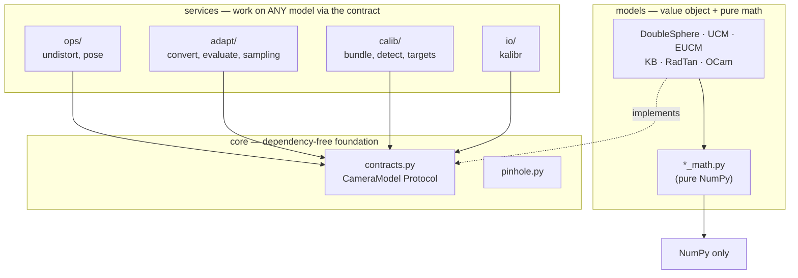

# Multi-Model Camera Library & Model Conversion

DS-MSP is not only a Double Sphere implementation — it is a small, uniform
multi-model camera library. **Calibrate in one model and convert the parameters to
any other**, then run every feature (project, unproject, undistort, PnP, calibrate,
Kalibr I/O) on any model interchangeably.

This capability is directly inspired by **Fisheye-Calib-Adapter** (Sangjun Lee,
2024); see [Credits](#credits). Everything here is pure Python (NumPy/SciPy/OpenCV)
with **analytic Jacobians** — no autodiff.

---

## 1. Supported models

All models implement the same `CameraModel` contract (`project`, `unproject`,
`project_jacobian`, serialization). Each ships pure math (`*_math.py`) plus a thin
value-object class.

| Model | Class | Params | Notes |
| :--- | :--- | :--- | :--- |
| Double Sphere | `DoubleSphereModel` | `fx, fy, cx, cy, xi, alpha` | wide <abbr title="Field Of View — the angular extent of the scene a lens captures.">FOV</abbr>, closed-form unprojection |
| UCM | `UCMModel` | `fx, fy, cx, cy, alpha` | unified (single sphere) = DS with ξ=0 |
| EUCM | `EUCMModel` | `fx, fy, cx, cy, alpha, beta` | enhanced UCM |
| DS+ | `DSPlusModel` | `fx, fy, cx, cy, alpha, lambda1, lambda2, tau_x, tau_y` | UCM core + division radial + 2-axis tilt |
| EUCM+ | `EUCMPlusModel` | `fx, fy, cx, cy, alpha, beta, lambda1, tau_x, tau_y` | EUCM core + division radial + 2-axis tilt, sqrt-only closed form |
| Kannala-Brandt | `KannalaBrandtModel` | `fx, fy, cx, cy, k1..k4` | **= OpenCV `cv2.fisheye`** |
| RadTan / pinhole | `RadTanModel` | `fx, fy, cx, cy, k1, k2, p1, p2, k3` | **= OpenCV `cv2.projectPoints`** (narrow FOV) |
| OCamCalib | `OCamModel` | `cx, cy, c, d, e, a0..a4` | Scaramuzza polynomial |
| (test stand-in) | `ds_msp.testing.FakeModel` | `fx, fy, cx, cy` | perfect pinhole, no fisheye math |

KB project matches `cv2.fisheye` and RadTan matches `cv2.projectPoints` to ~1e-13.
Every model's analytic Jacobian is gradient-checked against finite differences.

/// note
DS+ and EUCM+ are DS-MSP's own extensions, not part of any external calibration
toolchain's convention. See
[A fair fight — EUCM⁺ vs DS⁺ vs Kannala-Brandt](explain/case_study_eucmplus_dsplus_kb.md)
for where each one earns its extra parameters.
///

### How each model's 2D↔3D geometry works

All models share the same idea: **project** maps a 3D camera-frame point to a pixel,
**unproject** maps a pixel back to a unit bearing ray. They differ only in the
distortion they apply along the way:

- **Double Sphere** — projects through *two* offset unit spheres (`xi` = inter-sphere
  shift, `alpha` = blend). Handles >180° FOV with a closed-form unprojection.
- **UCM** — a single sphere (DS with `xi=0`); one `alpha` controls curvature.
- **EUCM** — UCM with a `beta` that stretches the radial term, fitting more lenses.
- **DS+ / EUCM+** — a UCM/EUCM core plus a division-model radial layer and a
  2-axis tilt homography, for lenses the plain sphere models can't bend to fit.
- **Kannala-Brandt** — equidistant: distorts the *angle* `θ` from the axis by an odd
  polynomial `θ + k1θ³ + k2θ⁵ + k3θ⁷ + k4θ⁹`. This is OpenCV's `cv2.fisheye`.
- **RadTan** — classic pinhole: perspective-divides, then applies Brown radial
  (`k1,k2,k3`) + tangential (`p1,p2`) distortion. Narrow FOV (needs `z>0`).
- **OCamCalib** — Scaramuzza: a polynomial in the sensor radius `ρ` plus an affine
  stretch; unprojection is the polynomial, projection inverts it numerically.

You don't need these details to use them — the API below is identical for all.

---

## 2. Converting between models (no images, no recalibration)

`convert(source, target_class, width=..., height=...)` fits `target_class` to
reproduce `source`'s geometry — no images, no recalibration required. Any model in
the library is a valid source or target.

#### How the fit works

The pipeline mirrors Fisheye-Calib-Adapter:

1. Sample a pixel grid across the image.
2. Unproject each pixel with the **source** model to a bearing ray.
3. Linear-seed the **target** model's distortion (intrinsics inherited from the
   source).
4. Refine with Levenberg-Marquardt, using the target's **analytic** parameter
   Jacobian, minimizing pixel reprojection error.

The returned report always includes the achieved error and FOV coverage, so a
lossy conversion is visible, never silent.

/// tip
The full API, every report field, and worked step-by-step recipes are in
[Convert between models](how-to/convert_between_models.md) — this page keeps the
library-wide picture; that page is the task recipe.
///

### Conversion quality (from the bundled DS calibration)

| Target | RMS (px) | Notes |
| :--- | :--- | :--- |
| EUCM | 0.014 | near-exact |
| KB | 0.0002 | near-exact, OpenCV-ready |
| OCamCalib | 0.55 | good |
| UCM | 0.334 | lossy — UCM has 1 shape parameter (`alpha`) vs. DS/EUCM's 2 |
| RadTan @ 90° FOV | 0.036 | pinhole can't hold wide FOV — restrict & report |

**Lossy conversions.** Narrow models (RadTan/pinhole) cannot represent a >180° FOV.
Pass `max_fov_deg=...` to restrict the fit and the report to the representable
region — see
[Restrict the FOV for narrow targets](how-to/convert_between_models.md#restrict-the-fov-for-narrow-targets)
for the full recipe.

---

## 3. Camera-geometry cookbook (identical on every model)

Every service depends only on the `CameraModel` contract, so **you swap models by
changing one line** — pick any model (calibrated directly or `convert`-ed) and the
rest of your code is unchanged.

Every snippet below uses the bundled Double Sphere sample calibration
(`DoubleSphereModel.sample()`) as `cam`. Swap that one line for `convert(cam,
KannalaBrandtModel, ...)`, or for any other model class, and nothing else changes.

### 3.1 Project / unproject (the core 2D↔3D geometry)

{* docs_src/guides/multi_model/project_unproject.py hl[17,22] *}

<!-- termynal -->
```
$ python -m docs_src.guides.multi_model.project_unproject
[[979.227, 518.81], [1028.735, 479.051]]
[True, True]
[[0.049938, 0.0, 0.998752], [0.131876, -0.065938, 0.989071]]
[1.0, 1.0]
```

`valid` flags points the model cannot represent (e.g. behind a narrow lens, or
outside a fisheye's FOV). Always mask by it. Every unprojected ray is unit-norm —
the last printed line confirms it.

### 3.2 Undistort an image to a pinhole view

{* docs_src/guides/multi_model/undistort_image.py hl[17:19] *}

<!-- termynal -->
```
$ python -m docs_src.guides.multi_model.undistort_image
(1080, 1920, 3)
426.84
```

`balance` slides from `0.0` (widest FOV, black borders) to `1.0` (tightest crop, no
borders); see [Undistort images](how-to/undistort_images.md) for the full
trade-off, measured.

### 3.3 Undistort / distort points (keypoints ↔ rectified frame)

{* docs_src/guides/multi_model/undistort_distort_points.py hl[21,26] *}

<!-- termynal -->
```
$ python -m docs_src.guides.multi_model.undistort_distort_points
[[715.819, 509.335], [923.194, 376.167]]
[True, True]
[[640.0, 480.0], [900.0, 300.0]]
round-trip max error: 2.89e-10 px
```

Use `undistort_points` to move detections into a pinhole frame for classic
algorithms; use `distort_points` to draw pinhole-space results back onto the
original fisheye image. Both round-trip to sub-pixel — **2.89e-10 px** here — on
every model.

### 3.4 Pose estimation (<abbr title="Perspective-n-Point — solving for camera pose from n known 3D points and their 2D projections.">PnP</abbr>)

{* docs_src/guides/multi_model/solve_pnp_cookbook.py hl[20] *}

<!-- termynal -->
```
$ python -m docs_src.guides.multi_model.solve_pnp_cookbook
ok=True
rvec=[-0.4809, -0.1674, -0.127]
tvec=[-0.2892, -0.0329, 0.4515]
```

`solve_pnp` works for any fisheye/omni model: it unprojects to bearing rays, keeps
the front-facing ones, and solves PnP in the normalized plane. See
[Solve PnP on a fisheye](how-to/solve_pnp_on_fisheye.md) for why a plain
`cv2.solvePnP` gets this wrong on raw fisheye pixels.

### 3.5 Direct OpenCV interop

`cam.K` and `cam.distortion` plug straight into OpenCV once you convert to KB or
RadTan — their distortion convention is exactly OpenCV's:

{* docs_src/guides/multi_model/opencv_interop.py hl[19,23,33,34] *}

<!-- termynal -->
```
$ python -m docs_src.guides.multi_model.opencv_interop
(1080, 1920, 3)
[[610.26, 480.33], [719.27, 469.54], [598.67, 589.42], [716.93, 580.87]]
```

The projected points land within a couple of pixels of the original detections
(`[610, 480]`, `[720, 470]`, `[600, 590]`, `[715, 580]`) — the round trip through
`convert` → `solve_pnp` → `cv2.projectPoints` is self-consistent.

### 3.6 Save to Kalibr YAML

Any model — calibrated directly or converted — writes to a standard Kalibr
camchain with `ds_msp.io.save_kalibr(cam, path, width, height)`. See
[Read/write Kalibr YAML](how-to/read_write_kalibr.md) for the exact field
orderings per model and a verified round-trip.

*(To calibrate a model from correspondences instead of loading one, see
[§4](#4-calibrate-any-model).)*

/// tip
**Swapping models is a one-line change.** Calibrate once, `convert` to whatever
model your downstream tool wants (OpenCV fisheye, a Kalibr pipeline, a pinhole
SLAM front-end…), and every call above behaves identically.
///

---

## 4. Calibrate any model

`ds_msp.calib.calibrate` bundle-adjusts **any** model using its analytic Jacobian —
the same backend the `ds-msp-calibrate` console command (checkerboard / ChArUco /
AprilGrid, config-driven, `pip install ds-msp` alone) drives via
`ds_msp.calib.single_camera.calibrate_camera`.

You supply per-image board points, detected pixels, and visibility masks — built
by detecting corners, or from known board geometry directly. The full recipe, a
runnable bundled example, and the `ds-msp-calibrate` CLI walkthrough are in
[Calibrate any model](how-to/calibrate_any_model.md).

---

## 5. Kalibr YAML interop

`ds_msp.io` reads and writes the standard Kalibr `camchain` format, with the exact
(source-verified) per-model field orderings — five model families (DS, EUCM, KB,
RadTan, UCM), plus the DS-MSP-only DS+/EUCM+ extensions.

[Read/write Kalibr YAML](how-to/read_write_kalibr.md) has the full field-ordering
table, a save/round-trip recipe verified to machine precision, and how to read
stereo extrinsics from a multi-camera camchain.

---

## 6. Architecture & design guarantees

The library is layered so each piece is independently testable. **Every arrow is
an allowed dependency direction; the reverse is forbidden** (and enforced in CI by
import-linter):



- **`core` imports nothing internal** — it's the foundation everything else rests
  on.
- **Services depend on the *contract*, not concrete models, and not each other.**
- **Each `*_math.py` is pure NumPy** — usable with no camera object at all.

Enforced by CI (pure-pytest gates):

- **`core` is dependency-free**; every `*_math` module is pure NumPy and
  self-contained (usable with no camera object).
- **Services depend on the contract, not concrete models** — proven by testing
  `convert`, `Undistorter`, `solve_pnp` against `FakeModel` with no fisheye model
  present.
- **Every model passes the same 14-check contract suite** (shapes, dtypes,
  round-trip, unit-norm rays, analytic-Jacobian gradient-check, serialization).
- **No autodiff** — all Jacobians are hand-derived and gradient-checked.

---

## Credits

The model-conversion capability is inspired by, and modeled on, prior open-source
work. Full attributions are in the main `README.md` "Credits" section; the most
direct sources:

- **Fisheye-Calib-Adapter** — Sangjun Lee, *"Fisheye-Calib-Adapter: An Easy Tool
  for Fisheye Camera Model Conversion"*, arXiv:2407.12405 (2024),
  [github.com/eowjd0512/fisheye-calib-adapter](https://github.com/eowjd0512/fisheye-calib-adapter).
  The sample→unproject→linear-seed→refine conversion pipeline and the set of
  supported models follow this work (re-implemented in Python with analytic
  Jacobians).
- **The Double Sphere Camera Model** — V. Usenko, N. Demmel, D. Cremers, 3DV 2018,
  arXiv:1807.08957; reference implementation
  [basalt-headers](https://gitlab.com/VladyslavUsenko/basalt-headers).
- **Kalibr** — Furgale et al., [github.com/ethz-asl/kalibr](https://github.com/ethz-asl/kalibr)
  (DS/EUCM models contributed by V. Usenko); YAML camchain format.
- **OpenCV** `fisheye` (Kannala-Brandt) and `calib3d` (radial-tangential) models.
- **OCamCalib** — D. Scaramuzza et al., the omnidirectional polynomial model.
- **EUCM** — B. Khomutenko, G. Garcia, P. Martinet (2016).
- **Kannala-Brandt** — J. Kannala, S. Brandt (2006).
