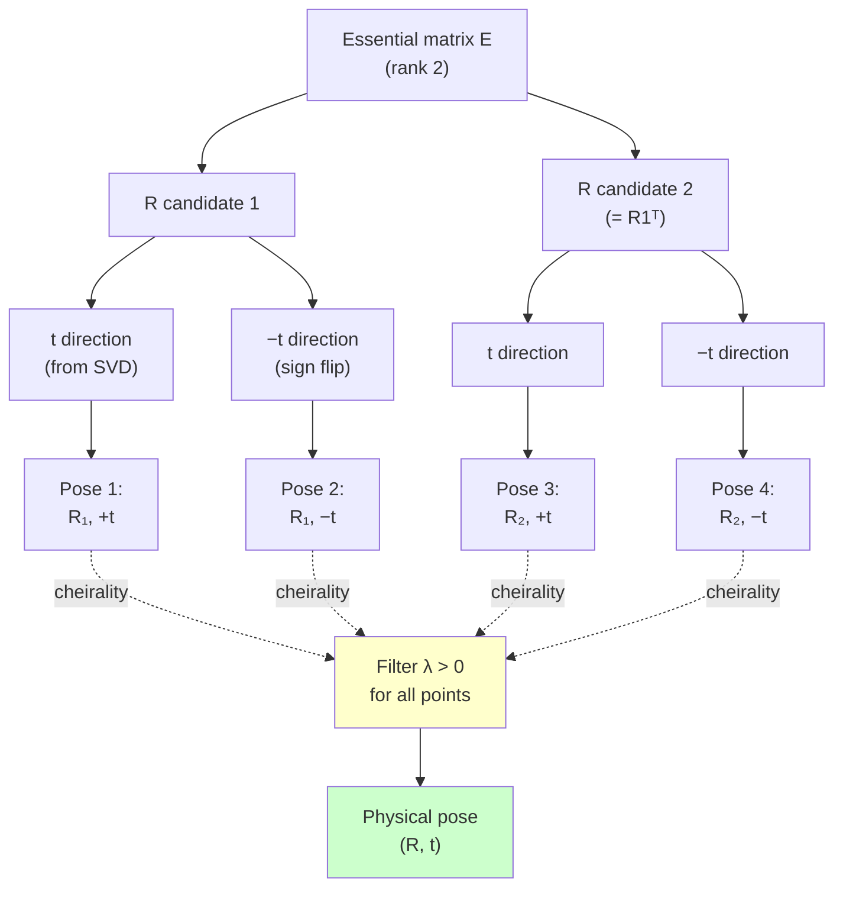

# Chapter 8 — Two-view geometry on rays

> **For:** readers who can already turn a fisheye pixel into a bearing ray (Chapters 1–3)
> and now want the relative pose `(R, t)` between two views of the same scene — without ever
> touching a pinhole.

Two images of one rigid scene fix the camera's motion between them, **up to the scale of the
translation**.

This chapter recovers that motion from feature correspondences expressed as **unit bearing
rays** — the native currency of a wide-<abbr title="Field of View">FOV</abbr> camera.

You'll go from 8 ray pairs to a pose in five lines.

You'll see why the math is identical for any central camera, make it robust to wrong matches,
and finish on a real <abbr title="Technical University of Munich Visual-Inertial">TUM-VI</abbr>
fisheye pair.

<div class="ds-stats">
  <div class="ds-stat"><span class="ds-stat__value">&lt;1e-3°</span><span class="ds-stat__label">synthetic round-trip pose error · CI-asserted</span></div>
  <div class="ds-stat"><span class="ds-stat__value">0.107°</span><span class="ds-stat__label">RANSAC rotation error @ 30% outliers</span></div>
  <div class="ds-stat"><span class="ds-stat__value">20 / 22</span><span class="ds-stat__label">inliers on a real TUM-VI pair</span></div>
</div>

> **You'll learn**
> - Recover `(R, t)` from ray correspondences with `recover_pose` — and prove it on a
>   synthetic Double Sphere scene to **< 1e-3°**.
> - Why the eight-point algorithm works on bearings, not just pixels.
> - The cheirality step, and why "in front" is **positive depth along the bearing ray**
>   (`λ > 0`), not `z > 0` (the Chapter 3 callback).
> - Make pose robust to outliers with `ransac_relative_pose`: **< 0.5°** under 30% bad matches.
>
> **Prerequisites**
> - **[Chapter 1](01_fisheye_and_camera_models.md)** — `project`/`unproject` are inverses; a
>   ray is `unproject(pixel)`.
> - **[Chapter 3](03_projection_validity.md)** — why `z > 0` is the wrong validity/cheirality
>   test for a >180° lens.
> - You've run the dataset fetcher (for §6). Setup: the [project README](README.md#setup-once).
>
> **Theory lives elsewhere.** This is a tutorial: it runs code and reports numbers. For the
> epipolar-constraint derivation, the four-fold decomposition proof, and numerical-stability
> notes, read the explanation page **[Two-view geometry](../explain/two_view_geometry.md)**.
> The chapter links to it; it does not restate it.

## On this page
- [The smallest thing that works](#1-the-smallest-thing-that-works-rays-in-pose-out)
- [Why rays, not pixels](#2-why-rays-not-pixels)
- [The eight-point estimator](#3-the-eight-point-estimator-on-rays)
- [Cheirality and decomposition](#4-decompose-and-pick-the-physical-pose-the-cheirality-step)
- [Robust matching with RANSAC](#5-make-it-robust-ransac-against-wrong-matches)
- [Real data: TUM-VI](#6-on-real-data-a-tum-vi-fisheye-pair)
- [Exercises](#try-it-yourself)

---

## 1. The smallest thing that works: rays in, pose out

Give `recover_pose` eight or more ray correspondences. It returns the relative rotation, the
unit translation direction, and the triangulated 3D points.

### The complete call

Here is the complete API call on a synthetic scene, before any theory:

{* docs_src/learn/two_view_geometry_on_rays/recover_pose_basic.py hl[42,43,45] *}

<div class="termy">

```console
$ python -m docs_src.learn.two_view_geometry_on_rays.recover_pose_basic
rotation error       : 0.00e+00 deg
translation-dir error: 0.00e+00 deg
```

</div>

### What just happened

You build the rays straight from the 3D points, so no pixel and no lens model ever touch
them. With no noise to absorb, `recover_pose` inverts the geometry exactly.

Both errors come back as machine-precision zero (`0.00e+00`) — the float64 round-off floor. In
§4 the same demo routes points through a real camera's project/unproject, and the errors there
are tiny but *nonzero* for exactly that reason.

That is the entire workflow. The rest of this chapter walks each piece, makes it survive real
data, and replaces `0.00e+00` with the honest numbers a real fisheye stream gives you.

/// tip | Why only a translation direction?
Two views can't tell a small scene nearby from a big scene far away — both look identical. So
`t` comes back **unit-length**; its scale is unobservable from two views. `recover_pose` fixes
the *sign* of `t` by cheirality (§4).
///

---

## 2. Why rays, not pixels

The eight-point algorithm you may have seen on pixels is really an algorithm on
**directions**.

### The epipolar constraint

The calibrated epipolar constraint holds on rays, for *any* central camera:

$$f_2^\top E\, f_1 = 0, \qquad E = [t]_\times R$$

`E` is the **essential matrix** (rank 2). This holds for the unit bearing rays `f1, f2` of
pinhole, Double Sphere, Kannala-Brandt, or UCM cameras alike — nothing in it is
pinhole-specific.

<figure markdown="span">
  { loading=lazy }
  <figcaption>Two cameras see the same points as unit bearing rays **f₁** (blue) and **f₂** (red). For the highlighted point, the two rays and the baseline **t** are coplanar — exactly the constraint **f₂ᵀ E f₁ = 0**. Verified residual ≤ 3.5×10⁻¹⁶ on these rays, computed from `ds_msp.mvg.essential_from_rays`.</figcaption>
</figure>

### A special case, not a different algorithm

The pixel-domain version you may have met is a special case. It works only because a pinhole
relates each pixel to its ray through one matrix `K`.

A fisheye has no such `K`: its pixel-to-ray map is the curved `unproject` of Chapters 1–2. So
you do the geometry one step earlier — on the rays themselves — and the same estimator works
for a 195° lens. That is why everything in `ds_msp.mvg` takes `(N, 3)` rays.

For *why* `f2ᵀ E f1 = 0` follows from the geometry, and why `E` has rank 2 with singular
values `(1, 1, 0)`, see **[Two-view geometry → the epipolar constraint](../explain/two_view_geometry.md)**.

---

## 3. The eight-point estimator on rays

`essential_from_rays` is the least-squares core: it solves `f2ᵀ E f1 = 0` over all
correspondences for the essential matrix `E`. Measure the fit with `epipolar_residual`, which
returns `f2ᵀ E f1` per pair — zero for a perfect fit.

{* docs_src/learn/two_view_geometry_on_rays/eight_point_residual.py hl[31,32] *}

<div class="termy">

```console
$ python -m docs_src.learn.two_view_geometry_on_rays.eight_point_residual
max epipolar residual: 5.69e-16
```

</div>

`5.69e-16` is float64 round-off: on noise-free data the rays satisfy `f2ᵀ E f1 = 0` exactly.

`essential_from_rays` needs **at least 8** correspondences; fewer raises `ValueError`. It also
takes an optional `normalize=True` for spherical pre-conditioning.

/// note | When normalization helps
`normalize=True` helps on noisy, narrow-baseline rays, and changes nothing in the noise-free
limit. You don't call it directly in this chapter; the real-data re-fit in
[`examples/11_two_view_pose_tumvi.py`](https://github.com/Munna-Manoj/DS-MSP/blob/main/examples/11_two_view_pose_tumvi.py) uses it.
///

---

## 4. Decompose and pick the physical pose — the cheirality step

An essential matrix does **not** uniquely give `(R, t)`: it factors into **four** candidates.
The decomposition splits `E = [t]_× R` into two possible rotation matrices and two possible
translation directions (±`t`). `recover_pose` builds all four, then applies **cheirality** to
pick the one where the triangulated points lie in front of both cameras.

### Four candidates, one physical pose

The four-way split and cheirality selection flow:



/// warning | The >180° callback (Chapter 3)
"In front" means **positive depth along the bearing ray** — the scale `λ > 0` in
`triangulate_rays` — **not** `z > 0`. A ray past 90° off-axis has a negative `z` and still
observes a point the lens genuinely sees.

Using `z > 0` as the cheirality test would reject every wide-angle correspondence and pick the
wrong one of the four poses.
[Chapter 3](03_projection_validity.md#2-the-validity-test-is-a-half-space-not-z-0) made this
point for the *validity* mask (the `z > -w₂·d₁` half-space, valid out to ~227°); cheirality is
the same point, one stage later.
///

### Proving it on a real fisheye camera

The §1 demo used hand-made rays. This one drives them through a real wide-FOV camera model —
`DoubleSphereModel` — to prove the pipeline is genuinely model-agnostic: project 3D points to
fisheye pixels in two views, unproject back to rays, recover the pose.

This mirrors `tests/mvg/test_two_view.py::test_recover_pose_through_a_real_double_sphere_camera`
exactly, so the number is asserted in <abbr title="Continuous Integration">CI</abbr>. Here is
the complete round-trip:

{* docs_src/learn/two_view_geometry_on_rays/double_sphere_roundtrip.py hl[40,41,43,44,46] *}

<div class="termy">

```console
$ python -m docs_src.learn.two_view_geometry_on_rays.double_sphere_roundtrip
valid pairs          : 60
rotation error       : 1.21e-06 deg
translation-dir error: 0.00e+00 deg
```

</div>

**Rotation error `~1.2e-6°`, translation-direction error `~0°`** — well under the `1e-3°` the
test asserts. The pose is exact to the precision of the camera's project/unproject round-trip.

The two-view geometry adds no error of its own. Notice that `mvg` never learns it was looking
at a fisheye: it only ever saw rays. That is the payoff of working on bearings.

<figure markdown="span">
  { loading=lazy }
  <figcaption>Recovered rotation error (1.21×10⁻⁶°) against the CI-asserted bound (&lt; 1×10⁻³°) — an 828× margin. Points are projected through a `DoubleSphereModel` to fisheye pixels, unprojected back to rays, then handed to `recover_pose`. The pose is exact to the camera's project/unproject round-trip.</figcaption>
</figure>

Notice too that all **60** pairs survive the `ok` mask. Every point here falls inside the
lens's valid cone (the
[Chapter 3](03_projection_validity.md#2-the-validity-test-is-a-half-space-not-z-0) half-space),
so `project` flags none of them invalid and the mask filters nothing.

Spread the scene wider — past the `θ_max` boundary Chapter 3 measures — and some points would
drop out, leaving fewer than 60 pairs. The pipeline handles that for free: it only ever feeds
the surviving rays to `recover_pose`.

For the proof that exactly four decompositions exist and why cheirality selects one, see
**[Two-view geometry → decomposing the essential matrix](../explain/two_view_geometry.md)**.

---

## 5. Make it robust: RANSAC against wrong matches

The eight-point estimator is least-squares, so a handful of mismatched rays — inevitable from
a real feature matcher — drag the whole fit off. `ransac_relative_pose` wraps the estimator in
<abbr title="Random Sample Consensus">RANSAC</abbr>: it samples minimal sets, scores each
candidate `E` by how many correspondences fit, and re-fits on the consensus.

It scores with a **Sampson distance on the sphere**, which is an angle in radians. The inlier
threshold is FOV-independent — the right currency for a fisheye, where a pixel threshold means
different angles at the centre and the rim.

### Corrupt 30% of the matches

Corrupt 30% of the matches and compare the naïve eight-point against RANSAC. The following
self-contained snippet shows the difference:

{* docs_src/learn/two_view_geometry_on_rays/ransac_vs_naive.py hl[47,50] *}

<div class="termy">

```console
$ python -m docs_src.learn.two_view_geometry_on_rays.ransac_vs_naive
naive  rotation error : 26.78 deg
RANSAC rotation error : 0.107 deg
RANSAC trans-dir error: 0.274 deg
inlier precision/recall: 0.989 / 1.000  (92/120)
```

</div>

### Naïve vs. robust

Here is a summary of how RANSAC recovers from 30% corrupted matches:

| Metric | Naïve eight-point | RANSAC |
| :--- | ---: | ---: |
| Rotation error | 26.78° | 0.107° |
| Translation-direction error | — | 0.274° |
| Inlier precision | — | 0.989 |
| Inlier recall | — | 1.000 |

The naïve fit is **~27° off** — useless. RANSAC recovers rotation to **0.107°** and the
translation direction to **0.274°**.

Inlier **precision 0.989 / recall 1.000**: it found every one of the ~91 good matches and
admitted almost no bad ones. The thresholds asserted in `tests/mvg/test_ransac.py` are rotation
`< 0.5°`, translation-direction `< 2.0°`, precision `> 0.95`, recall `> 0.9` — all met with
margin.

<figure markdown="span">
  { loading=lazy }
  <figcaption>Per-correspondence angular Sampson residual against the RANSAC consensus, sorted ascending. Blue: the 92 inliers, all below the 0.005 rad threshold. Red: the 28 corrupted matches, reaching ~1.8 rad. The naïve eight-point on all 120 contaminated rays gives 26.78° rotation error; RANSAC recovers 0.107°. From `ds_msp.mvg.ransac_relative_pose`.</figcaption>
</figure>

/// note | Watch this as outliers rise
RANSAC's iteration budget tracks the inlier ratio: the fraction of random 8-samples that land
*all* inliers drops fast as outliers rise. Push exercise 2's outlier fraction up to see it.

At very low inlier ratios the default `max_iters=1000` may never draw a clean 8-sample, and
recall collapses. Raising `max_iters` buys back some headroom.
///

---

## 6. On real data: a TUM-VI fisheye pair

Synthetic rays are noise-free; real ones are not. The companion example
[`examples/11_two_view_pose_tumvi.py`](https://github.com/Munna-Manoj/DS-MSP/blob/main/examples/11_two_view_pose_tumvi.py)
runs the exact same pipeline on two real TUM-VI `room1` fisheye frames.

It <abbr title="Kanade-Lucas-Tomasi">KLT</abbr>-tracks features between them (reusing the
tracker from [`examples/09`](https://github.com/Munna-Manoj/DS-MSP/blob/main/examples/09_monocular_vo_tumvi.py)),
unprojects both pixel sets through the **loaded** calibrated model to rays, and runs
`ransac_relative_pose`.

### Run the example

<div class="termy">

```console
$ python examples/11_two_view_pose_tumvi.py --start 400 --gap 4
camera: KannalaBrandtModel  fx=190.98 cx=254.93
frames 400 -> 404: 22 KLT matches
valid bearing pairs: 22 / 22

RANSAC relative pose (20 inliers / 22 = 90.9%):
  inlier Sampson residual: median 2.01e-02 rad  max 2.59e-02 rad  (~1.149 deg)
  recovered |t| direction vs mocap baseline: ~108.3 deg (coarse; camera != world frame)
```

</div>

/// note | End-to-end on real fisheye
The pipeline runs on a real TUM-VI fisheye stream. Only 22 KLT matches survive this particular
4-frame gap (low-texture frames; try `--start 700` for ~80).

RANSAC keeps **20 of 22** (90.9% inliers) with a median angular residual of **~0.02 rad
(~1.1°)** — an order of magnitude looser than the synthetic exercise's `5.69e-16`, because real
KLT corners on a real fisheye carry real subpixel noise. The pipeline still recovers one
consistent pose from noisy, real measurements — that consistency, not machine-precision
agreement, is the point on real data.
///

/// warning | Demonstration, not a guarantee
The deterministic correctness claim is the synthetic round-trip in §4 (`< 1e-3°`, asserted in
CI). On real data the translation *direction* check against the mocap baseline is only coarse.

The recovered `t` lives in the camera frame, the mocap baseline in the world/body frame, and
there's an unknown camera-to-body rotation on top of the lever arm — so don't read the `~108°`
as pose error.

With no extrinsic correction applied, this raw angle mixes the real recovered motion with an
arbitrary frame offset. It isn't meant to look small — it's a placeholder for the
*frame-aligned* check Chapter 9 builds toward, which is where a genuinely tight number belongs.
///

/// note | A different model, same code
The camera printed as `KannalaBrandtModel`, not Double Sphere — that's the model TUM-VI ships
in its calibration file. The two-view code didn't care: it only ever saw rays. That's §2's
model-agnostic claim, demonstrated on a different model than §4 used.
///

---

## Try it yourself

Predict first, then run. The exercises below ask you to change one parameter and observe how
it affects the pose estimate:

1. **Vary the rotation magnitude.** In §1, change `0.6` in `rodrigues(rng.standard_normal(3),
   0.6)` to `0.05` (a tiny rotation, almost no parallax). Predict first: does the error grow or
   stay near zero?

   Then add noise — `f2 += 1e-3 * rng.standard_normal(f2.shape)` — and re-run. Small-baseline
   two-view geometry is ill-conditioned; watch the error climb far faster at `0.05` than at
   `0.6`.
2. **Push the outlier fraction.** In §5, raise `0.30` to `0.50`, then `0.70`. Predict where
   RANSAC's recall collapses before you run it.
3. **Move the real pair apart.** Run `examples/11_two_view_pose_tumvi.py` with `--gap 1` (tiny
   baseline) and `--gap 12` (large baseline, fewer surviving tracks). Which gives the lower
   Sampson residual, and why is the tiny-baseline case noisier even with more matches?

## Recap and next step

You recovered relative pose from bearing rays with `recover_pose`, and proved it exact on a
synthetic Double Sphere scene (**~1e-6°**, CI-asserted `< 1e-3°`).

You made it robust with `ransac_relative_pose` (**0.107°** under 30% outliers), and ran the
whole thing on a real TUM-VI fisheye pair (**~90.9% inliers, ~1.1° residual** — an order of
magnitude looser than the synthetic exercises, because real KLT corners carry real subpixel
noise).

The pose here is a closed-form two-view estimate. The next step is to **refine** it.
`refine_two_view` runs iterative Levenberg–Marquardt on the rotation–translation manifold
(SO(3) × S²), minimizing angular reprojection error to drive the residual below what the
one-shot estimate reaches.

That closed-form pose becomes the seed, and the same machinery extends to chains of poses and
points — full bundle adjustment. That's **Chapter 9 — manifold optimization**
(`ds_msp.mvg.refine_two_view`).
