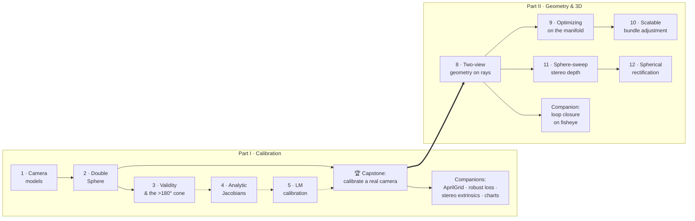

# Learn: fisheye & omnidirectional camera geometry, from first principles

A guided, **runnable** path through wide-<abbr title="Field of View">FOV</abbr> camera
models — the geometry behind <abbr title="Simultaneous Localization And Mapping">SLAM</abbr>,
AR, and robot perception.

Every chapter pairs a short explainer with a script that runs on **real public data** and
prints a **number you can verify**.

/// tip | The house rule
In 3D vision you don't *hope* your math is right — you *measure* that it is. A good
unprojection inverts projection to ~1e-14 px, not "looks about right."
///


*Where this leads — the [capstone](capstone_calibrating_a_real_camera.md): calibrate a real
fisheye from scratch until the model (red) predicts every detected corner (green) to a tenth
of a pixel, matching the published reference.*

This is the **teaching layer**. The library it teaches (`ds_msp/`) stays deliberately clean
and untouched by tutorial clutter:

- Read the docs to learn.
- Read the code to see how it's done in production.

Looking for the "why" behind a proof or a derivation, not a hands-on walkthrough? That lives
in [**Explanation**](../explain/README.md) — kept separate so this track stays runnable
end to end.

## Who this is for
Aspiring 3D-vision researchers, applied-perception engineers, and developers who know
some Python + linear algebra and want to *actually understand* (not just call) camera
models. No prior fisheye knowledge assumed.

## Setup (once)
```bash
# 1. Environment (uv recommended; venv/conda fine too)
uv venv --python 3.12 && source .venv/bin/activate
uv pip install -e .            # core library (Chapters 1–2)
uv pip install -e ".[calib]"   # + AprilGrid detector, for the calibration capstone

# 2. Data — small, free, ~3 GB for the fisheye track
bash scripts/download_datasets.sh tumvi
```
See [`datasets/README.md`](https://github.com/Munna-Manoj/DS-MSP/blob/main/datasets/README.md) for what each dataset contains.

## The path

The track has two arcs:

- **Part I — Calibration** takes one camera from "what is a fisheye" to a published-grade
  calibration you reproduce yourself, then a set of companion chapters that go deeper on
  specific pieces of that pipeline.
- **Part II — Geometry & 3D** takes that calibrated camera *out into the world*: two-view
  pose, manifold optimization, and stereo depth — the geometry behind SLAM and
  <abbr title="Structure from Motion">SfM</abbr>.

Part II's **library is shipped and tested** (`ds_msp/mvg/`, `ds_msp/core/`,
`ds_msp/stereo/`). Its chapters and runnable examples are landing now — see the
[ROADMAP](../ROADMAP.md).



- **Solid arrows** = runnable today: Ch.1 → Ch.2 → capstone → companions.
- **Dotted arrows** = theory chapters landing incrementally.
- Part II Ch.8 is runnable today; Ch.9–12 land incrementally on top of the shipped, tested
  library.

### Part I — Calibration

| # | Chapter | You'll be able to… | Code anchor |
|---|---------|--------------------|-------------|
| 1 | [Fisheye & camera models](01_fisheye_and_camera_models.md) | load a real calibration, prove project/unproject are inverses, rectify a fisheye frame | `examples/01_realdata_fisheye_tumvi.py` |
| 2 | [The Double Sphere model](02_double_sphere_model.md) | derive DS projection, read it in code, and reproduce a published calibration with it | `examples/02_double_sphere_tumvi.py` |
| 3 | [Projection validity & the >180° cone](03_projection_validity.md) | explain why `z>0` is the classic bug, and *measure* the >180° valid cone (227° here) | `examples/07_fov_and_validity.py` |
| 4 | Analytic Jacobians vs autodiff *(coming soon)* | derive a Jacobian and gradient-check it | `ds_msp/model.py` |
| 5 | Calibration by Levenberg–Marquardt *(deep-dive coming soon — the recipe itself already runs)* | calibrate from corner detections | [capstone](capstone_calibrating_a_real_camera.md), [how-to](../how-to/calibrate_any_model.md) → `ds_msp/calib/bundle.py` |
| 6 | [One model to another: conversion](../how-to/convert_between_models.md) | turn a DS calib into KB/EUCM without re-shooting | `ds_msp/adapt/` |
| 7 | Reproducing a published calibration *(TUM-VI done via the capstone; EuRoC coming soon)* | match TUM-VI / EuRoC reference numbers with your own code | [capstone](capstone_calibrating_a_real_camera.md) → `ds_msp/io/kalibr.py` |

### 🏆 The capstone (runnable now)

**[Calibrate a real fisheye camera and match the published numbers](capstone_calibrating_a_real_camera.md)**
is the artifact every chapter builds toward.

Detect **AprilGrid** corners in TUM-VI's raw footage, bundle-adjust the intrinsics from
scratch, and land on the calibration the dataset authors published — to **~0.02%** focal
(0.080 px median reprojection).

You can run it after Chapter 2. Code: `examples/03_calibrate_tumvi_aprilgrid.py`.

### Capstone companions — go deeper on one piece of the pipeline

Each of these takes a specific step inside the capstone and puts it under a microscope —
same TUM-VI data, a runnable script, and a number you verify.

Read them after the capstone, in any order. They don't depend on each other.

| Chapter | You'll be able to… | Code anchor |
|---------|--------------------|--------------|
| [Detecting every AprilGrid tag, even at the fisheye periphery](robust_aprilgrid_detection.md) | explain why a fully-visible board drops to 4/36 tags off-centre, and apply the multi-scale + board-guided recovery fix that takes recall 36%→94% and tightens the focal fit 0.7%→~0.02% | `examples/03_calibrate_tumvi_aprilgrid.py` |
| [Robust losses vs hard rejection — and why naive RMS lies](robust_losses_and_evaluation.md) | apply a Cauchy loss that down-weights bad corners without discarding them, derive the IRLS weighting, and score a robust fit by median / inlier RMS instead of RMS | `examples/04_robust_vs_rejection.py` |
| [Stereo extrinsics: recovering a rig's camera-to-camera transform](stereo_extrinsics_calibration.md) | recover a rig's camera-to-camera transform from a shared board, average per-frame poses (chordal mean + median), and score it against a published reference (**0.062° rotation, 0.25 mm baseline**, ~0.2%) | `examples/06_stereo_extrinsics_tumvi.py` |
| [Sphere, cylinder, pinhole: one camera, three images, and the pixel math that links them](spherical_and_cylindrical_reprojection.md) | derive the exact pixel↔pixel maps between three charts of the same camera (verified to 1e-13 px round-trip), and find where the cylinder silently drops the polar cone | `examples/08_reproject_sphere_cylinder.py` |

Chapters land incrementally — see [`../ROADMAP.md`](../ROADMAP.md) for the build order.

### Part II — Geometry & 3D *(library shipped & tested; chapters + examples landing)*

A fisheye measures **rays**, so this whole arc is built on `project` / `unproject`:

- Epipolar lines become curves.
- Disparity becomes angular.
- The essential matrix still holds — on unit bearing vectors.

| # | Chapter | You'll be able to… | Code anchor (shipped) |
|---|---------|--------------------|-----------------------|
| 8 | [Two-view geometry on rays](08_two_view_geometry_on_rays.md) | recover relative pose from an image pair — essential matrix on bearings, ray triangulation, on-sphere RANSAC — on a real TUM-VI fisheye pair | `ds_msp/mvg/` (`two_view.py`, `ransac.py`) |
| 9 | Optimizing on the manifold *(chapter pending)* | see why flat pose parameterization is a *correctness* bug, and how an in-house SO(3)/SE(3) LM solver fixes it | `ds_msp/core/` (`lie.py`, `optimize.py`) |
| 10 | Scalable bundle adjustment *(chapter pending)* | minimize angular reprojection error with a Schur-complement sparse solve | `ds_msp/mvg/bundle.py`, `ds_msp/calib/bundle.py` |
| 11 | Sphere-sweep stereo depth *(chapter pending)* | get dense depth straight on raw fisheye — no rectification, no pinhole detour | `ds_msp/stereo/sphere_sweep.py` |
| 12 | Spherical epipolar rectification *(chapter pending)* | the pedagogically-clean depth path; matches sphere-sweep to <1% | `ds_msp/stereo/rectify.py` |

Part II companion: [**Loop closure on fisheye images**](loop_closure_on_fisheye.md) builds a
deterministic hierarchical binary vocabulary and inverted index on TUM-VI, then verifies
retrieval candidates with DS-MSP's calibrated bearing-ray RANSAC. Code:
`examples/12_loop_closure_tumvi.py`.

Chapter 8's formal companion — the epipolar-constraint proof, the four-fold decomposition, and
the numerical-stability notes — lives in Explanation:
[**Two-view geometry on bearing vectors**](../explain/two_view_geometry.md).

## Looking for the "why", not the "how"?

Some questions in this space aren't a hands-on skill — they're a conceptual puzzle worth
settling once, in depth:

- "Are two calibrations of the same lens really the same camera?"
- "Which model should I pick?"

Those live in [**Explanation**](../explain/README.md), so this tutorial track stays focused
on runnable, hands-on chapters.

## How to use it

Read the chapter, run its script, then **change one thing and predict what happens** before
you re-run. Try:

- A different `balance`.
- A wider pixel grid.
- `cam1` instead of `cam0`.

The fastest way to learn geometry is to break it on purpose and watch the number move.
