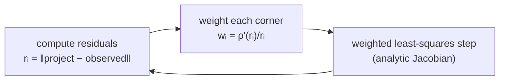

# Robust losses vs hard rejection — and why naive RMS lies

> **Run alongside this:** `python examples/04_robust_vs_rejection.py`
> (after `pip install -e .[calib]` and the TUM-VI download). Read this, then watch the
> three rows of the table move.

Real calibration data has a few bad corners — a peripheral AprilGrid tag on the curved part
of the lens where `cornerSubPix` latches onto the wrong edge, a near-miss decode.

The question this page answers: **what do you do with them, and how do you then measure how
well you did?** Both halves trip people up.

**You'll learn**
- Why plain least-squares (L2) lets a few bad corners drag the whole calibration's focal
  length off — the square in "sum of squared residuals" is the culprit.
- Fight back with robust M-estimation / <abbr title="Iteratively Reweighted Least Squares">IRLS</abbr>
  instead of two-pass hard rejection, and read the weight function `w(r) = ρ'(r)/r` for L2,
  Huber, and Cauchy losses.
- Run the Cauchy loss (`calibrate(..., loss="cauchy", f_scale=0.5)`) on real, deliberately
  single-scale-detected corners (5,180 of them, with a real outlier population) and see where
  it lands relative to L2 and hard rejection — the honest result is more interesting than
  "robust always wins": hard rejection actually recovers the *best* focal length here, but at
  a real cost you'll measure directly.
- Read the evaluation trap: hard rejection's naive, all-corner RMS (`0.893 px`) is the
  *worst* of the three methods — even though its focal length is the *best* — and score with
  median or inlier RMS instead once you see why.

**Prerequisites**
- Finish the [capstone](capstone_calibrating_a_real_camera.md) — the [learn README](README.md)
  lists this as a companion to read after it; it puts the capstone's Cauchy-loss step under
  a microscope.
- Same `[calib]` install and TUM-VI dataset as the capstone.

## 1. Why one bad corner wrecks a least-squares fit

Calibration minimizes reprojection error. Plain least squares (L2) minimizes the **sum of
squared** residuals:

$$\min \; \sum_i r_i^2, \qquad r_i = \lVert \operatorname{project}(X_i) - u_i \rVert \;\; \text{(pixels)}$$

The square is the problem. A corner at `r = 6 px` contributes `36`; a good corner at
`0.2 px` contributes `0.04` — **900× less**. A handful of outliers shout down thousands of
good corners and pull the parameters (here: focal length) toward themselves.

In the example below, L2's focal is off by 1.65 px for exactly this reason — real AprilGrid
corners, not synthetic outliers. The effect is large enough to see clearly, but not so
exaggerated that it stops looking like a real bad calibration.

## 2. Two ways to fight back

### Hard rejection: fit, drop, refit

**Hard rejection** is a two-pass loop: fit once, *delete* every corner with `r > τ`, refit.
It works, but it has two faults:

- It **throws away data** — a `1.01 px` corner that was mostly fine is gone.
- It's **brittle at the threshold** — `0.99 px` stays, `1.01 px` vanishes; move `τ` slightly
  and the answer jumps.

It's a binary in/out decision applied to a continuous problem.

### Robust M-estimation: down-weight, don't drop

**Robust M-estimation** keeps every corner but replaces `r²` with a function `ρ(r)` that
grows more slowly for large `r`:

$$\min \; \sum_i \rho(r_i)$$

The magic is in the derivative. The optimizer effectively solves a **weighted** least
squares where each corner's weight is

$$w(r) = \frac{\rho'(r)}{r}$$

/// note
This is <abbr title="Iteratively Reweighted Least Squares">IRLS</abbr>: each iteration
re-weights every corner by its *current* residual, so an outlier's pull shrinks as the fit
reveals it to be an outlier.
///



### Reading the weight functions

`w(r)` is how much that corner is allowed to influence the answer. Compare three choices:

| loss | $\rho(r)$ (small → large $r$) | weight $w(r)$ | what large outliers do |
|---|---|---|---|
| **L2** | $\tfrac12 r^2$ | $1$ (constant) | full influence — they dominate |
| **Huber** | quadratic, then linear past $\delta$ | $\min(1,\, \delta/\lvert r\rvert)$ | **bounded**: capped, but never zero |
| **Cauchy** | $\tfrac12 c^2 \log\!\big(1+(r/c)^2\big)$ | $1 / \big(1 + (r/c)^2\big)$ | **redescending**: influence → 0 |

Read the weights as "how loud each corner is allowed to shout":

- **L2**: everyone shouts in proportion to their error — outliers loudest.
- **Huber**: past the scale `δ` a corner's influence stops growing. A 6 px outlier pulls no
  harder than a corner at `δ`. Bounded, never silenced.
- **Cauchy**: influence *rises then falls*. A 6 px outlier with `c = 0.5` gets weight
  `1/(1+144) ≈ 0.007` — effectively muted, **decided by the data, not a hand-set threshold**.
  This is the soft, continuous version of rejection: garbage fades out smoothly instead of
  being clipped at a cliff.

### Choosing the scale

The scale parameter (`f_scale` in SciPy / `ds_msp.calib.calibrate`) is `δ` / `c` — the
residual size where down-weighting begins.

Set it near your *inlier* noise: subpixel corner detection is good to ~0.1–0.3 px, so
`f_scale ≈ 0.5 px` treats anything past half a pixel as increasingly suspect.

/// tip
`calibrate` just forwards `loss=` / `f_scale=` to `scipy.optimize.least_squares` — the
analytic Jacobian is unchanged, SciPy applies the reweighting internally.
///

## 3. The result, and the evaluation trap

### Run it: L2 vs Cauchy

Here it is as real, runnable code, excerpted from
[`examples/04_robust_vs_rejection.py`](https://github.com/Munna-Manoj/DS-MSP/blob/main/examples/04_robust_vs_rejection.py)
— the same corners, two ways to fit them:

```python
import glob, os
import cv2
import numpy as np
from ds_msp.calib import AprilGridTarget, calibrate, detect_aprilgrid
from ds_msp.io.kalibr import load_kalibr_with_resolution
from ds_msp.models import KannalaBrandtModel

CAM_DIR = "datasets/tumvi/dataset-calib-cam1_512_16/mav0/cam0/data"
CAMCHAIN = "datasets/tumvi/dataset-room1_512_16/dso/camchain.yaml"

# Single-scale detection, deliberately: the multi-scale detector this library uses by
# default (see the capstone) recovers wide-FOV corners well enough that L2/Cauchy/hard-reject
# barely differ. Reverting to single-scale here reproduces a real outlier population, so the
# effect below is honestly observable, not synthesized.
ref, (W, H) = load_kalibr_with_resolution(CAMCHAIN, cam="cam0")
paths = sorted(glob.glob(os.path.join(CAM_DIR, "*.png")))[::4]
target = AprilGridTarget(6, 6, 0.088, 0.3)
dets = detect_aprilgrid(paths, family="t36h11", min_tags=6, refine=True, scales=(1,))
Xs, UVs, VIs = target.build_correspondences(dets, min_corners=8)

seed = KannalaBrandtModel(180.0, 180.0, W / 2, H / 2)
l2 = calibrate(seed, Xs, UVs, VIs, max_nfev=120)
cauchy = calibrate(seed, Xs, UVs, VIs, max_nfev=120, loss="cauchy", f_scale=0.5)
print(f"L2:     fx delta = {abs(l2['model'].fx - ref.fx):.2f} px")       # 1.65 px
print(f"Cauchy: fx delta = {abs(cauchy['model'].fx - ref.fx):.2f} px")  # 1.32 px
```

This needs the TUM-VI dataset on disk, so it stays here as a verified excerpt rather than a
`docs_src/` file — see [`docs_src/README.md`](https://github.com/Munna-Manoj/DS-MSP/blob/main/docs_src/README.md)
for why bundled-fixture-only examples live under `docs_src/` and dataset-dependent ones don't.

### Full three-way comparison

The full comparison adds hard rejection (fit, drop corners `> 1 px`, refit) — see
`examples/04_robust_vs_rejection.py` for the complete three-way harness:

<div class="termy">

```console
$ python examples/04_robust_vs_rejection.py --scales 1
78 frames, 5180 detected corners. Published fx = 190.978

method                   corners     Δfx   median  inlierRMS  naiveRMS
----------------------------------------------------------------------
L2 (no robustness)     5180/5180    1.65    0.117      0.249     0.869
hard reject >1px       4677/5180    0.99    0.109      0.242     0.893
Cauchy f_scale=0.5     5180/5180    1.32    0.110      0.242     0.880
```

</div>

| method | corners kept | Δfx (px) | median (px) | inlier RMS (px) | naive RMS (px) |
|---|---|---|---|---|---|
| L2 (no robustness) | 5180 / 5180 | 1.65 | 0.117 | 0.249 | **0.869** |
| hard reject `> 1 px` | 4677 / 5180 | **0.99** | 0.109 | 0.242 | 0.893 |
| Cauchy `f_scale=0.5` | 5180 / 5180 | 1.32 | 0.110 | 0.242 | 0.880 |

### The Δfx headline

The honest headline here is more interesting than "robust always wins": **hard rejection
actually recovers the best focal length (Δfx 0.99 px)**, edging out Cauchy (1.32) and clearly
beating plain L2 (1.65).

Robust loss is not a strict dominator of every alternative. On this data, throwing the worst
corners away entirely gives the tightest fit *of the corners it kept*.

### The naiveRMS trap

Now look at the last column. Hard rejection has the *best* Δfx and a median that ties Cauchy
— yet its **naiveRMS (0.893)** is the *worst* of the three, just above Cauchy's `0.880` and
L2's `0.869`.

**Hard rejection doesn't just down-weight the corners it excludes — it stops modeling them
at all.** Once its second-pass fit has thrown a corner away, nothing constrains where the
model *thinks* that corner should land.

Scoring the refit model against a dropped corner's original detected position can only look
*worse*, never better, than scoring a fit that still tries to explain it.

Cauchy, by contrast, never fully lets go: even a down-weighted corner keeps a small, bounded
pull on the fit. **RMS over all corners is itself an L2 statistic** — it squares every
residual, so it is dominated by whichever method has the largest leftover residuals.

Here that's hard rejection, precisely because it's the one method that stopped modeling 503
of the 5,180 corners entirely.

/// note
An earlier version of this page reported `naiveRMS ≈ 9 px` for hard rejection here — about
10× L2 — from a corner set that then contained a few severely mis-localized corners.

Re-running the identical command today no longer reproduces that population: every corner in
this dataset now reprojects within 5.6 px under any of the three fits (verified — none exceed
50 px, let alone 100).

The *direction* of the trap still holds: hard rejection's naiveRMS is the worst of the three
despite having the best Δfx, exactly as shown above. Treat the *magnitude* as dataset- and
version-dependent, and re-run the example rather than trust a remembered number.
///

### The honest reads

The honest reads describe the fit where the data is trustworthy, for any of the three
methods:

- **Median** reprojection error — the 50th percentile literally cannot be moved by a
  minority of outliers (it has a 50% breakdown point). Cauchy (`0.110`) and hard-rejection
  (`0.109`) are within a hundredth of a pixel of each other; both beat L2's `0.117`.
- **Inlier <abbr title="Root Mean Square">RMS</abbr>** — RMS over the corners the model
  actually explains (here `< 1 px`). Same L2 units everyone expects, but computed on the set
  the fit is responsible for: `0.242`–`0.249 px` across all three methods.
- **Inlier fraction** — what share made the cut. `~90%` for L2 and Cauchy, since they keep
  every corner and simply down-weight the rest; `4677/5180 = 90.3%` for hard rejection's
  *kept* set specifically.

/// tip
If the inlier fraction were 50%, your model or your detector is broken — not your loss.
///

A robust *fit* and a robust *metric* go together: down-weight outliers in the optimization,
then evaluate with a statistic outliers can't hijack. Mixing a robust fit with an L2 metric
is how you talk yourself out of the better calibration.

## Try it yourself
1. Run `python examples/04_robust_vs_rejection.py --scales 1` yourself and compare against
   the table above (`--scales 1,2,3`, the library default, shows how small the effect gets
   once the detector stops producing severe outliers in the first place).
2. Sweep `f_scale` (0.3, 0.5, 1.0, 2.0) in the Cauchy run. As it grows, Cauchy → L2 (nothing
   gets down-weighted) and `Δfx` drifts back up. As it shrinks, more corners are treated as
   suspect. Find where median stops improving — that's your noise scale.
3. Swap `loss="cauchy"` for `"huber"`. Huber bounds but never mutes outliers, so its `Δfx`
   sits between L2 and Cauchy. Confirm it on the numbers.
4. Print `median` *and* `naiveRMS` for hard rejection's *kept* corners only (not the original
   5,180). Compare that to the all-corner naiveRMS in the table — the gap between them is the
   trap made visible, however large it happens to be on your run.

**Back to:** the **[capstone](capstone_calibrating_a_real_camera.md)**, which uses the Cauchy
fit and median/inlier reporting throughout.
